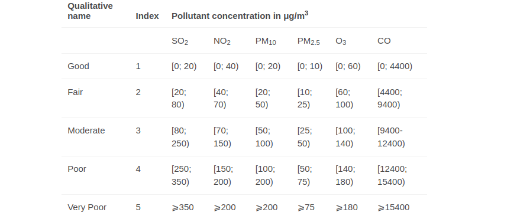

# URBO : Sustainable Urban Planning Tool 

## Project Summary
In today's world, urbanization is rapidly increasing, and with it comes the challenge of designing cities that are both 
functional and eco-friendly. Environmental concerns like global warming, rising CO2 levels, and diminishing green spaces 
are urging us to rethink how we plan our cities and communities. A well-designed urban area should not only cater to human 
needs but also help in preserving the planet.

Introducing the Sustainable Urban Planning Tool, an intelligent solution designed to help urban planners and individuals
make data-driven decisions for building more sustainable cities. This tool enables users to search for essential urban 
elements like parks, hotels, roads, offices, traffic zones, and more, by providing key insights (recommendation) that can influence 
eco-friendly development strategies. 

## Minimum Requirements
- Get the data from [Mapple API](https://apis.mappls.com/) for few cities from different countries
- Define the internal criteria to have specific requirements in the city. 
- Example, City must minimum 10 parks based on its radius , City must have 5 different school or education systems. 
- Display Geocode (Longitude and Latitude ) of the city
- Display still image of Map of city
- Display current average Air Quality Index (need to see if i can get this from different api)
- Calculate the percentage of green spaces (e.g., parks, forests) based on the total radius.
- Public transport analysis: Suggest improvements for public transport if the city lacks sufficient transportation hubs based on density, keyword searches for bus/train stations, etc.
- Based on above data define custom criteria and provide recommendations preserve and expand green spaces.

### Component 1: User Input
- Allow user to select city 
- Other option is to give input as keyword (to search specific term like forest , parks, hotels)
- Add validation to filter inputs else display respective error or message
- Ensure that the user input is valid and handles any errors that may occur during data entry

### Component 2: Data analysis
- Based on user input, find the city related data insights.
- Based on keyword (examples parks) define the internal criteria to have specific requirements in the city
- Additionally include : Weather and Air Quality Index , Geocodes, Static map , details about city
- Static Map of city
- Own recommendations to optimize urban planning
- (Need to check : if i can get free another api to get co2 emission of same city)

Note:
There is scope to use [Mapple API](https://apis.mappls.com/) or other API endpoints.
Currently, I have created free account, which will give access to less data ( 20  records )
More info - Ref- https://github.com/mappls-api/mappls-rest-apis/tree/main/mappls-maps-near-by-api-example

## Reference 
Air Quality index is calculated based on -

# Web App Architecture Design - 

### UI- https://github.com/nazneenprojects/urbo-frontend.git

### Backend - https://github.com/nazneenprojects/urbo.git
### Postgres DB - https://render.com/

####  Pending tasks -
- To complete the UI screens
- To Host the backend and frontend over Render
- To add GithubWorkflow
- Monitor CI/CD pipeline
- add Unit test cases to the backend layer
